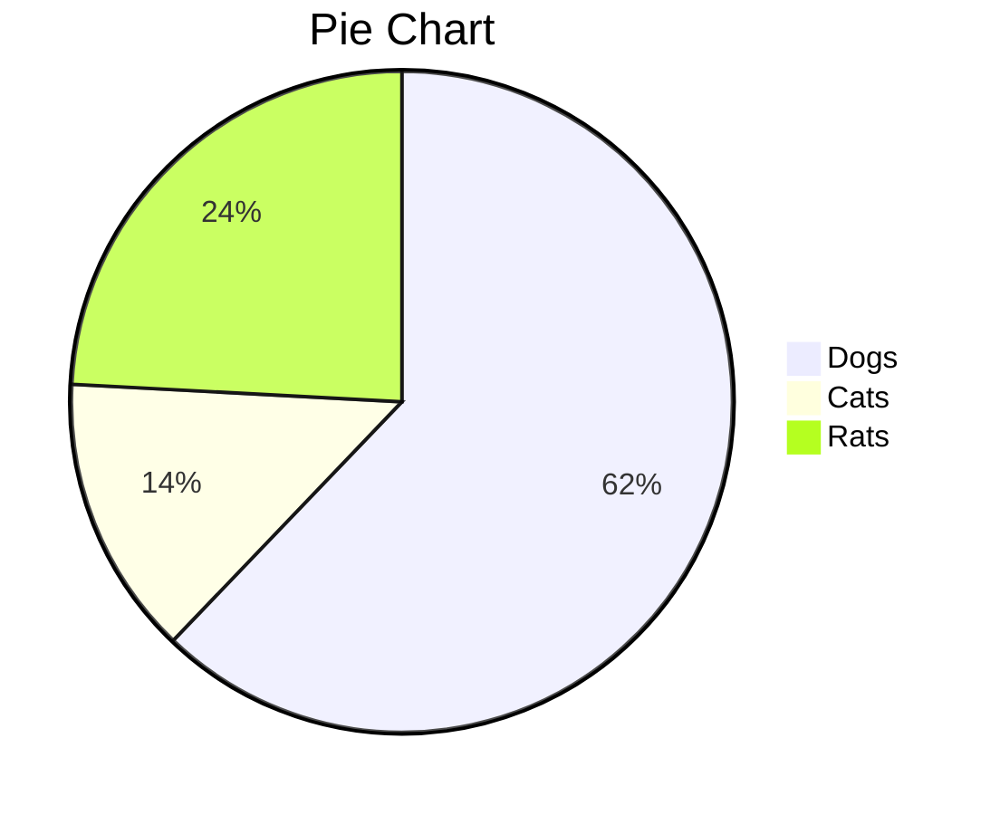
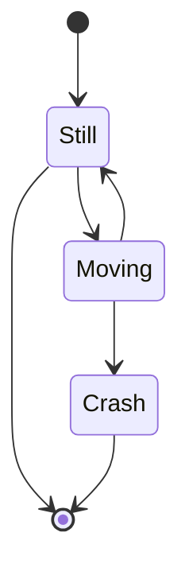
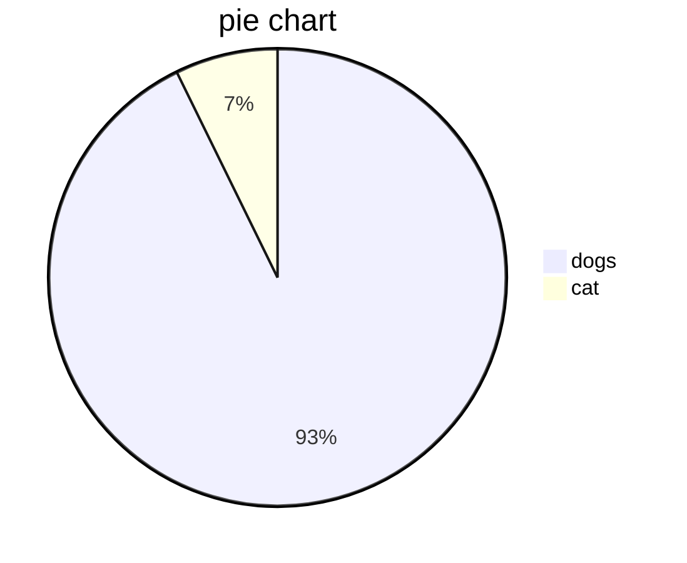
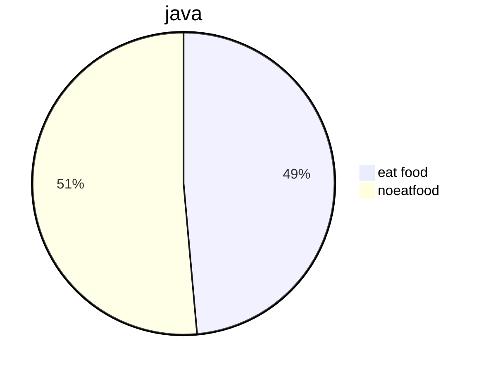

# 共享单车

## 特点

```java
public class Test1{
    public static void main（String[]args）{
        System.out.println("Hello World")
    }
}
```


```python

```


```csharp
[简书](http://jianshu.com)
     
```

```html
<a href="https://www.jianshu.com/u/1f5ac0cf6a8b" target="_blank">简书</a>
```

```cpp


:crystal_ball:

:

~~~gfm

~~~


~~~gfm
```mermaid
stateDiagram
    [*] --> Still
    Still --> [*]

    Still --> Moving
    Moving --> Still
    Moving --> Crash
    Crash --> [*]
``````mermaid
stateDiagram
    [*] --> Still
    Still --> [*]

    Still --> Moving
    Moving --> Still
    Moving --> Crash
    Crash --> [*]
```
~~~



| jj    |jj f     |jjjj|
|:------:|:-------:|:-----------:|
|1-5    |1334      |jee|
```java
public class test2{
	public static void main(String[]args){
		System.out.println("hello world")
		
```

```sequence
Alice->Bob: Hello Bob, how are you?
Note right of Bob: Bob thinks
Bob-->Alice: I am good thanks!
```
```java

